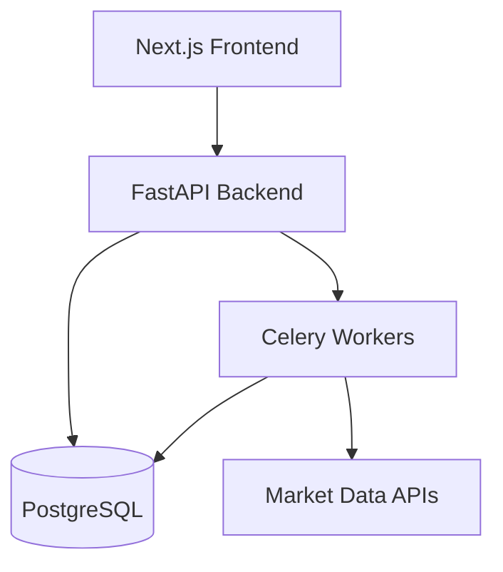

# Portfolium

Portfolium is a personal project.

It started as a practical need: tracking my investments properly, without relying on closed platforms, vague numbers, or product-driven financial apps.

Over time, it became something else — a technical playground, and a system I fully understand end to end.

## The problem

Most portfolio tracking tools suffer from at least one of these:

- incomplete or delayed data
- opaque calculations
- dependency on third-party services
- ads or trading incentives
- limited control over your own data

I wanted something simple:

> My data.  
> My rules.  
> My calculations.

## What Portfolium does

Today, Portfolium can:

- track multi-asset portfolios (stocks, ETFs, crypto)
- store transaction history
- compute performance, cost basis, allocations
- visualize portfolio evolution over time
- export data

The goal is not to “beat the market”, but to clearly understand what I’m doing.

## A small example

A simplified version of how portfolio metrics are computed:

```ts
type Transaction = {
  asset: string;
  quantity: number;
  price: number;
};

function computeCostBasis(transactions: Transaction[]): number {
  return transactions.reduce(
    (total, tx) => total + tx.quantity * tx.price,
    0
  );
}
```

Nothing fancy — just deterministic logic, readable and testable.

## Architecture overview

A simplified view of the system:



## A technical project first

Portfolium is also a lab.

I use it to experiment with:

- clean backend architectures
- financial data pipelines
- automation (sync, aggregation, scheduled jobs)
- risk and performance metrics
- interfaces designed for clarity, not marketing dashboards

The tool is useful. The process is even more valuable.

## Why write about it here

Because it reflects how I work:

- start from a real problem
- build something minimal
- improve it iteratively
- document what works (and what breaks)

I’ll publish more technical articles about Portfolium here: architecture, design choices, mistakes, optimizations, and limits.

## Current state

The project is constantly evolving.  
It’s not “finished”, and probably never will be.

That’s fine.