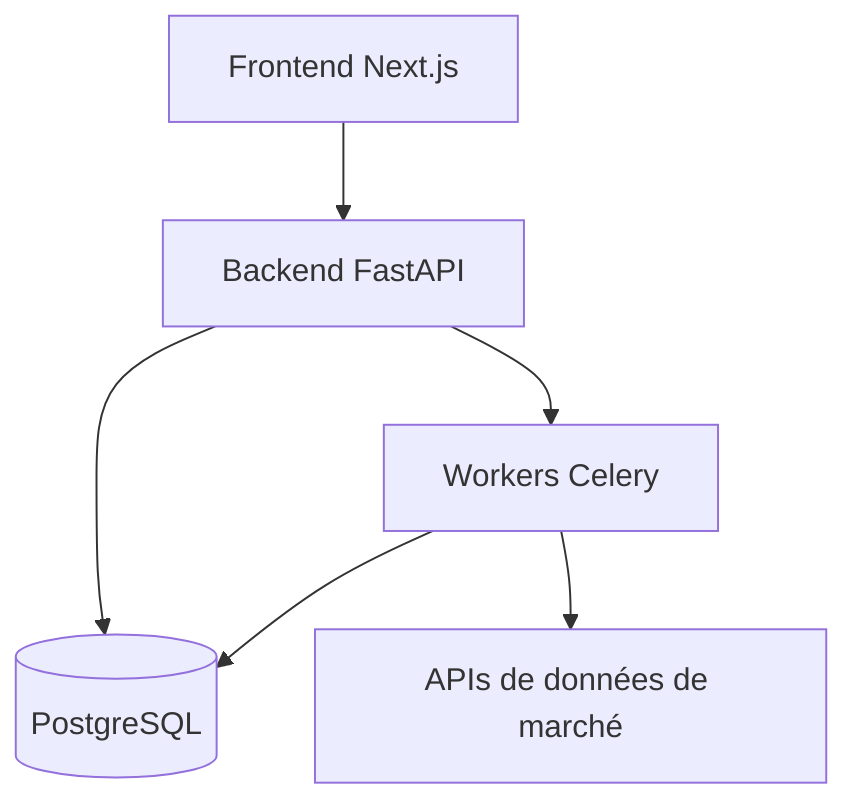

# Portfolium

Portfolium est un projet personnel.

À l’origine, c’était un besoin pratique : suivre mes investissements proprement, sans dépendre de plateformes fermées, de chiffres flous ou d’applications financières orientées “produit”.

Avec le temps, c’est devenu autre chose — un terrain d’expérimentation technique, et un système que je comprends de bout en bout.

## Le problème

La plupart des outils de suivi de portefeuille ont au moins l’un de ces défauts :

- données incomplètes ou en retard
- calculs opaques
- dépendance à des services tiers
- publicité ou incitations au trading
- peu de contrôle sur ses propres données

Je voulais quelque chose de simple :

> Mes données.  
> Mes règles.  
> Mes calculs.

## Ce que fait Portfolium

Aujourd’hui, Portfolium permet de :

- suivre des portefeuilles multi-actifs (actions, ETF, crypto)
- conserver l’historique des transactions
- calculer les performances, le PRU, les allocations
- visualiser l’évolution dans le temps
- exporter les données

L’objectif n’est pas de “battre le marché”, mais de comprendre précisément ce que je fais.

## Un petit exemple

Version simplifiée du calcul du prix de revient :

```ts
type Transaction = {
  asset: string;
  quantity: number;
  price: number;
};

function computeCostBasis(transactions: Transaction[]): number {
  return transactions.reduce(
    (total, tx) => total + tx.quantity * tx.price,
    0
  );
}
```

Rien de sophistiqué — juste une logique déterministe, lisible et testable.

## Aperçu de l’architecture

Vue simplifiée du système :



## Un projet technique avant tout

Portfolium est aussi un laboratoire.

Je l’utilise pour tester :

- des architectures backend propres
- des pipelines de données financières
- de l’automatisation (synchronisation, agrégation, tâches planifiées)
- des métriques de risque et de performance
- des interfaces pensées pour la lisibilité, pas pour le marketing

L’outil est utile. Le processus l’est encore plus.

## Pourquoi en parler ici

Parce que ça reflète ma façon de travailler :

- partir d’un problème réel
- construire quelque chose de minimal
- l’améliorer par itérations
- documenter ce qui marche (et ce qui casse)

Je publierai ici d’autres articles techniques sur Portfolium : architecture, choix de conception, erreurs, optimisations et limites.

## État actuel

Le projet évolue en permanence.  
Il n’est pas “terminé”, et ne le sera probablement jamais.

Et c’est très bien comme ça.
